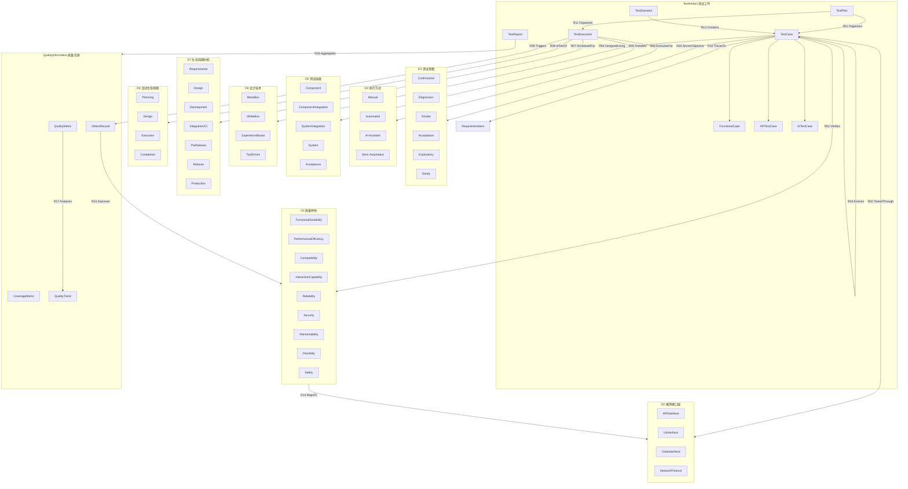
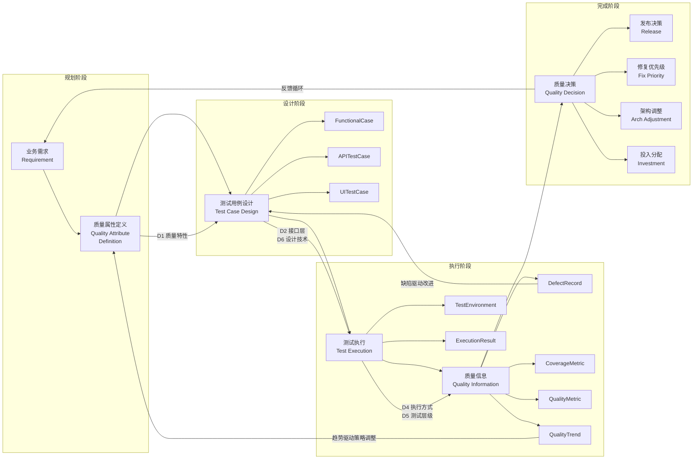

# 质量工程领域本体论建模研究报告

## 概述

本报告基于MeterSphere测试平台的**8维测试活动矩阵**（73条活动记录）和**数据库schema设计**（50+核心表），运用本体论的思想和方法，对质量工程领域进行全面的概念建模和知识梳理。

本研究不受限于当前工程实现，而是**从质量工程的本质出发**，抽象出核心概念、建立严谨的领域关系，为平台的战略架构提供本体论基础。

---

## 第一部分：质量工程领域本体的核心视点

### 1.1 质量工程的本质定义

> **基础定义引用**：测试的本质定义为「质量信息获取活动」，详见 [testing-orthogonal-dimensions.md](testing-orthogonal-dimensions.md) 的核心定义。

**质量工程的扩展定义**：在测试本质之上，质量工程是「质量信息获取与决策支持的系统工程」——不仅获取信息，更强调信息对质量决策的支持能力。

```
组织目标
  ↓
业务需求 → 质量属性定义 → 验证活动设计 → 信息获取 → 质量决策 → 产品发布
                                                              ↑
                                                    缺陷与改进信息
```

### 关键观察：

1. **质量工程不产出软件功能**，而是产出**关于软件质量的信息**
2. **测试活动是信息获取的手段**，而非测试本身是目标
3. **质量决策是根本目的**：发布/修复优先级/架构调整/投入分配

这意味着，本体模型应围绕以下核心问题构建：
- 验证**什么质量属性**？（D1-质量特性）— 详见 [testing-orthogonal-dimensions.md](testing-orthogonal-dimensions.md#维度-1质量特性quality-characteristic)
- 通过**什么接口**进行验证？（D2-接口层）— 详见 [testing-orthogonal-dimensions.md](testing-orthogonal-dimensions.md#维度-2被测接口层test-interface-object-layer)
- **为什么**要进行该验证？（D3-测试意图）— 详见 [testing-orthogonal-dimensions.md](testing-orthogonal-dimensions.md#维度-3测试意图目的testing-objective-purpose)
- **如何**进行验证？（D4-D7）— 详见 [testing-orthogonal-dimensions.md](testing-orthogonal-dimensions.md)
- 验证的**结果信息**如何支持决策？（D8-生命周期视角）— 详见 [testing-orthogonal-dimensions.md](testing-orthogonal-dimensions.md#维度-8活动生命周期状态activity-lifecycle-state)

---

## 第二部分：概念层次结构（Taxonomy）

### 2.1 顶层概念分类

基于ISO 25010:2023和ISTQB v4.0，质量工程领域的顶层概念可分为**5个主类别**：

#### (1) QualityDimension 质量维度 (抽象基类)

```
QualityDimension (Abstract Root Concept)
  │
  ├── QualityCharacteristic (质量特性) - ISO 25010 定义
  │   ├── FunctionalSuitability (功能适合性)
  │   ├── PerformanceEfficiency (性能效率)
  │   ├── Compatibility (兼容性)
  │   ├── InteractionCapability (交互能力) - 2023新命名
  │   ├── Reliability (可靠性)
  │   ├── Security (安全性)
  │   ├── Maintainability (可维护性)
  │   ├── Flexibility (灵活性) - 2023新命名，原Portability
  │   └── Safety (安全保障) - 2023新增
  │
  ├── TestInterface (被测接口层)
  │   ├── APIInterface
  │   │   ├── HTTPRest
  │   │   ├── gRPC
  │   │   ├── GraphQL
  │   │   ├── TCP
  │   │   ├── MQTT
  │   │   └── WebSocket
  │   ├── UIInterface
  │   │   ├── WebUI
  │   │   └── MobileUI
  │   ├── CodeInterface
  │   │   ├── SourceCode
  │   │   └── Bytecode
  │   ├── NetworkProtocol
  │   └── DependencyInterface
  │       ├── LibraryDependency
  │       └── ContainerImage
  │
  ├── TestObjective (测试意图/目的)
  │   ├── ConfirmationTesting (确认测试)
  │   ├── RegressionTesting (回归测试)
  │   ├── SmokeTesting (冒烟测试)
  │   ├── AcceptanceTesting (验收测试)
  │   ├── ExploratoryTesting (探索性测试)
  │   └── SanityTesting (理性检查)
  │
  ├── ExecutionMode (执行方式)
  │   ├── ManualExecution
  │   ├── AutomatedExecution
  │   ├── AIAssistedExecution
  │   └── SemiAutomatedExecution
  │
  └── TestLevel (测试层级) - ISTQB 5级
      ├── ComponentTesting (组件测试)
      ├── ComponentIntegrationTesting (组件集成)
      ├── SystemIntegrationTesting (系统集成)
      ├── SystemTesting (系统测试)
      └── AcceptanceTesting (验收测试)
```

#### (2) TestDesignTechnique 测试设计技术

```
TestDesignTechnique (Abstract)
  ├── BlackBoxTechnique (黑盒)
  │   ├── EquivalencePartitioning
  │   ├── BoundaryValueAnalysis
  │   ├── DecisionTable
  │   └── StateTransition
  ├── WhiteBoxTechnique (白盒)
  │   ├── StatementCoverage
  │   ├── BranchCoverage
  │   └── PathCoverage
  ├── ExperienceBased (经验型)
  │   ├── ExploratoryTesting
  │   ├── ErrorGuessing
  │   └── ChecklistBased
  └── ToolDrivenTechnique (工具驱动)
      ├── StaticAnalysis
      ├── DynamicAnalysis
      └── CompositionAnalysis
```

#### (3) SDLCTiming 生命周期时机

```
SDLCTiming (Abstract)
  ├── RequirementsPhase (需求阶段) - Shift-Left
  ├── DesignPhase (设计阶段)
  ├── DevelopmentPhase (开发阶段) - 单元测试/TDD
  ├── IntegrationPhase (集成阶段) - CI
  ├── PreReleasePhase (发布前) - 系统/验收测试
  ├── ReleasePhase (发布阶段)
  └── ProductionPhase (生产环境) - Shift-Right
```

#### (4) TestArtifact 测试工件 (核心执行单元)

```
TestArtifact (Abstract Root)
  ├── TestCase (测试用例)
  │   ├── FunctionalCase (功能用例) - 与接口层无关的纯业务规格
  │   ├── APITestCase (API用例) - 绑定API接口层
  │   └── UITestCase (UI用例) - 绑定UI接口层
  │
  ├── TestScenario (测试场景/多步场景)
  │
  ├── TestPlan (测试计划)
  │   ├── scope: List<TestArtifact>
  │   ├── strategy: TestStrategy
  │   └── schedule: Schedule
  │
  ├── TestExecution (测试执行) - 见下方详细展开
  │
  │
  └── TestReport (测试报告)
      ├── aggregation: ResultAggregation
      ├── analysis: QualityAnalysis
      └      └── recommendations: List<Recommendation>
```

#### (4.1) TestExecution 测试执行 (详细展开)

> **背景**：随着自动化测试比例的大幅提升，执行管理成为质量工程的核心能力。现代执行场景涉及并行执行、分布式调度、容器化环境、失败智能分析等复杂需求。

```
TestExecution (核心聚合根)
  │
  ├── ExecutionRequest (执行请求)
  │   ├── ExecutionTrigger (触发器)
  │   │   ├── ManualTrigger (手动触发)
  │   │   ├── CITrigger (CI集成触发)
  │   │   │   ├── WebhookTrigger (Webhook触发)
  │   │   │   ├── PipelineTrigger (Pipeline集成触发)
  │   │   │   └── CommitTrigger (代码提交触发)
  │   │   ├── ScheduleTrigger (定时调度触发)
  │   │   │   ├── CronTrigger (Cron定时触发)
  │   │   │   ├── RecurringTrigger (周期触发)
  │   │   │   └── OneTimeTrigger (一次性触发)
  │   │   └── BatchTrigger (批量触发)
  │   │
  │   ├── ExecutionStrategy (执行策略)
  │   │   ├── SequentialExecution (顺序执行)
  │   │   ├── ParallelExecution (并行执行)
  │   │   │   ├── ShardedParallel (分片并行)
  │   │   │   ├── MatrixParallel (矩阵并行)
  │   │   │   └── DistributedParallel (分布式并行)
  │   │   └
  │   ├── ExecutionMatrix (执行矩阵配置)
  │   │   ├── BrowserMatrix (浏览器矩阵)
  │   │   │   ├── Chrome, Firefox, Safari, Edge...
  │   │   ├── PlatformMatrix (平台矩阵)
  │   │   │   ├── Windows, macOS, Linux, iOS, Android...
  │   │   ├── VersionMatrix (版本矩阵)
  │   │   └── ParameterMatrix (参数化矩阵)
  │   │
  │   └── ExecutionConfig (执行配置)
  │       ├── timeout: Duration
  │       ├── retryPolicy: RetryPolicy
  │       ├── failureThreshold: FailureThreshold
  │       └       └── continueOnFailure: Boolean
  │
  ├── ExecutionQueue (执行队列)
  │   ├── ExecutionJob (执行任务单元)
  │   │   ├── jobId: JobId
  │   │   ├── targetArtifact: TestArtifact
  │   │   ├── priority: Priority
  │   │   ├── status: JobStatus (QUEUED/RUNNING/COMPLETED/FAILED)
  │   │   ├── assignedWorker: WorkerId
  │   │   └       └── createdAt: DateTime
  │   │
  │   ├── QueuePriorityPolicy (队列优先级策略)
  │   │   ├── FIFO (先进先出)
  │   │   ├── PriorityWeighted (权重优先)
  │   │   ├── RiskBased (风险驱动)
  │   │   └       └── DeadlineDriven (截止时间驱动)
  │   │
  │   └── QueueMetrics (队列度量)
  │       ├── queueLength: Integer
  │   │   ├── averageWaitTime: Duration
  │   │   └       └── throughput: Float
  │
  ├── ExecutionResourcePool (执行资源池)
  │   ├── ExecutionWorker (执行工作节点)
  │   │   ├── workerId: WorkerId
  │   │   ├── workerType: WorkerType
  │   │   │   ├── ContainerWorker (容器工作节点)
  │   │   │   ├── VMWorker (虚拟机工作节点)
  │   │   │   ├── AgentWorker (Agent工作节点)
  │   │   │   └       └── CloudWorker (云端工作节点)
  │   │   ├── capacity: CapacitySpec
  │   │   ├── status: WorkerStatus (IDLE/BUSY/OFFLINE)
  │   │   ├── currentLoad: LoadMetric
  │   │   └       └── healthStatus: HealthStatus
  │   │
  │   ├── ExecutionSlot (执行槽位)
  │   │   ├── slotId: SlotId
  │   │   ├── slotType: SlotType
  │   │   │   ├── BrowserSlot (浏览器槽位)
  │   │   │   ├── APISlot (API执行槽位)
  │   │   │   ├── PerformanceSlot (性能执行槽位)
  │   │   │   └       └── SecuritySlot (安全执行槽位)
  │   │   ├── allocatedJob: JobId
  │   │   └       └── allocatedAt: DateTime
  │   │
  │   └── ResourceAllocationPolicy (资源分配策略)
  │   │   ├── StaticAllocation (静态分配)
  │   │   ├── DynamicAllocation (动态弹性分配)
  │   │   └       └── PredictiveAllocation (预测性分配)
  │   │
  │   └── ResourceMetrics (资源度量)
  │       ├── totalSlots: Integer
  │       ├── availableSlots: Integer
  │   │   ├── utilizationRate: Float
  │   │   └       └── pendingAllocations: Integer
  │
  ├── ExecutionEnvironment (执行环境)
  │   ├── EnvironmentSpec (环境规格)
  │   │   ├── EnvironmentType
  │   │   │   ├── StaticEnvironment (静态环境)
  │   │   │   ├── EphemeralEnvironment (临时环境)
  │   │   │   ├── ContainerizedEnvironment (容器化环境)
  │   │   │   │   ├── DockerContainer
  │   │   │   │   └       └── KubernetesPod
  │   │   │   └       └── SandboxedEnvironment (沙箱环境)
  │   │   ├── EnvironmentVariables: Map<String, String>
  │   │   ├── NetworkConfig: NetworkSpec
  │   │   └       └── DataFixture: DataFixtureSpec
  │   │
  │   ├── EnvironmentLifecycle (环境生命周期)
  │   │   ├── EnvironmentSetup (环境准备)
  │   │   │   ├── Provisioning (资源分配)
  │   │   │   ├── Configuration (配置注入)
  │   │   │   └       └── DataSeeding (数据预置)
  │   │   ├── EnvironmentRuntime (环境运行时)
  │   │   │   ├── HealthCheck (健康检查)
  │   │   │   ├── Monitoring (运行监控)
  │   │   │   └       └── Logging (日志采集)
  │   │   └       └── EnvironmentTeardown (环境销毁)
  │   │           ├── DataCleanup (数据清理)
  │   │           ├── ResourceRelease (资源释放)
  │   │           └       └── SnapshotSave (快照保存)
  │   │
  │   └── EnvironmentIsolation (环境隔离)
  │   │   ├── ProcessIsolation (进程隔离)
  │   │   ├── ContainerIsolation (容器隔离)
  │   │   ├── NetworkIsolation (网络隔离)
  │   │   └       └── DataIsolation (数据隔离)
  │
  ├── ExecutionRuntime (执行运行时)
  │   ├── ExecutionSession (执行会话)
  │   │   ├── sessionId: SessionId
  │   │   ├── startTime: DateTime
  │   │   ├── endTime: DateTime
  │   │   ├── status: SessionStatus
  │   │   └       └── progress: ProgressMetric
  │   │
  │   ├── ExecutionStep (执行步骤实例)
  │   │   ├── stepId: StepId
  │   │   ├── stepOrder: Integer
  │   │   ├── stepStatus: StepStatus
  │   │   ├── stepDuration: Duration
  │   │   ├── stepResult: StepResult
  │   │   └       └── stepLog: LogEntry
  │   │
  │   └ ExecutionSnapshot (执行快照)
  │   │   ├── snapshotId: SnapshotId
  │   │   ├── snapshotType: SnapshotType
  │   │   │   ├── ScreenCapture (屏幕截图)
  │   │   │   ├── LogSnapshot (日志快照)
  │   │   │   ├── StateSnapshot (状态快照)
  │   │   │   └       └── NetworkSnapshot (网络快照)
  │   │   ├── capturedAt: DateTime
  │   │   └       └── metadata: SnapshotMetadata
  │   │
  │   └── ExecutionArtifact (执行产出物)
  │   │   ├── artifactId: ArtifactId
  │   │   ├── artifactType: ArtifactType
  │   │   │   ├── LogFile (日志文件)
  │   │   │   ├── ReportFile (报告文件)
  │   │   │   ├── EvidenceFile (证据文件)
  │   │   │   └       └── DataExport (数据导出)
  │   │   ├── storagePath: Path
  │   │   └       └── retentionPolicy: RetentionPolicy
  │
  ├── ExecutionResult (执行结果)
  │   ├── ResultSummary (结果汇总)
  │   │   ├── totalTests: Integer
  │   │   ├── passedTests: Integer
  │   │   ├── failedTests: Integer
  │   │   ├── skippedTests: Integer
  │   │   ├── blockedTests: Integer
  │   │   ├── passRate: Float
  │   │   └       └── executionDuration: Duration
  │   │
  │   ├── ResultDetail (结果详情)
  │   │   ├── testCaseId: TestCaseId
  │   │   ├── resultStatus: ResultStatus
  │   │   │   ├── PASSED (通过)
  │   │   │   ├── FAILED (失败)
  │   │   │   ├── SKIPPED (跳过)
  │   │   │   ├── BLOCKED (阻塞)
  │   │   │   ├── FLAKY (不稳定)
  │   │   │   └       └── RETRIED (已重试)
  │   │   ├── failureReason: FailureReason
  │   │   ├── errorMessage: String
  │   │   ├── stackTrace: String
  │   │   └       └── evidence: List<Evidence>
  │   │
  │   ├── FailureCategorization (失败分类)
  │   │   ├── FailureType
  │   │   │   ├── ProductDefect (产品缺陷)
  │   │   │   ├── AutomationDefect (自动化脚本缺陷)
  │   │   │   ├── EnvironmentIssue (环境问题)
  │   │   │   ├── DataIssue (数据问题)
  │   │   │   ├── NetworkIssue (网络问题)
  │   │   │   ├── ConfigurationIssue (配置问题)
  │   │   │   └       └── KnownFailure (已知失败)
  │   │   ├── FailureSeverity
  │   │   │   ├── CriticalFailure
  │   │   │   ├── MajorFailure
  │   │   │   ├── MinorFailure
  │   │   │   └       └── TrivialFailure
  │   │   ├── FailurePattern
  │   │   │   ├── IntermittentFailure (间歇性失败 - Flaky)
  │   │   │   ├── ConsistentFailure (一致性失败)
  │   │   │   ├── EnvironmentSpecific (环境特定失败)
  │   │   │   └       └── TimeSpecific (时间特定失败)
  │   │   └       └── ConfidenceLevel: Float (分类置信度)
  │   │
  │   └── ResultAnalysis (结果分析)
  │   │   ├── RootCauseHint (根因提示)
  │   │   │   ├── AIAnalysisResult (AI分析结果)
  │   │   │   ├── PatternMatchResult (模式匹配结果)
  │   │   │   ├── HistoricalCorrelation (历史关联)
  │   │   │   └       └── CodeChangeCorrelation (代码变更关联)
  │   │   ├── Recommendation (修复建议)
  │   │   │   ├── FixRecommendation (修复建议)
  │   │   │   ├── RetryRecommendation (重试建议)
  │   │   │   ├── SkipRecommendation (跳过建议)
  │   │   │   └       └── QuarantineRecommendation (隔离建议)
  │   │   └       └── SimilarFailureGrouping (相似失败分组)
  │   │
  ├── ExecutionRetry (执行重试)
  │   ├── RetryPolicy (重试策略)
  │   │   ├── RetryCount: Integer
  │   │   ├── RetryDelay: Duration
  │   │   ├── RetryBackoff: BackoffStrategy
  │   │   │   ├── FixedBackoff
  │   │   │   ├── LinearBackoff
  │   │   │   └       └── ExponentialBackoff
  │   │   └       └── RetryCondition: RetryConditionSpec
  │   │
  │   ├── RetryExecution (重试执行实例)
  │   │   ├── retryId: RetryId
  │   │   ├── retryCount: Integer
  │   │   ├── retryReason: RetryReason
  │   │   ├── retryStatus: RetryStatus
  │   │   └       └── retryResult: RetryResult
  │   │
  │   └── FlakyTestManagement (不稳定测试管理)
  │   │   ├── FlakyDetection (不稳定检测)
  │   │   │   ├── PassRateThreshold: Float
  │   │   │   ├── DetectionWindow: Duration
  │   │   │   └       └── MinimumExecutions: Integer
  │   │   ├── FlakyQuarantine (不稳定隔离)
  │   │   │   ├── QuarantineStatus: QuarantineStatus
  │   │   │   ├── QuarantineReason: String
  │   │   │   ├── QuarantineDuration: Duration
  │   │   │   └       └── QuarantineReview: ReviewRecord
  │   │   └       └── FlakySkipPolicy (不稳定跳过策略)
  │   │           ├── AutoSkipThreshold: Float
  │   │           └       └── ManualReviewRequired: Boolean
  │
  └── ExecutionReport (执行报告)
  │   ├── ReportGeneration (报告生成)
  │   │   ├── ReportTemplate: TemplateId
  │   │   ├── ReportFormat: ReportFormat
  │   │   │   ├── HTML
  │   │   │   ├── PDF
  │   │   │   ├── JSON
  │   │   │   ├── XML
  │   │   │   └       └── Markdown
  │   │   └       └── ReportSections: List<ReportSection>
  │   │
  │   ├── ReportAggregation (报告聚合)
  │   │   ├── MultiExecutionAggregation (多执行聚合)
  │   │   ├── CrossEnvironmentAggregation (跨环境聚合)
  │   │   ├── HistoricalAggregation (历史聚合)
  │   │   └       └── TrendAggregation (趋势聚合)
  │   │
  │   └       └── ReportDistribution (报告分发)
  │   │           ├── NotificationChannel: List<Channel>
  │   │           │   ├── EmailNotification
  │   │           │   ├── SlackNotification
  │   │           │   ├── WebhookNotification
  │   │           │   └       └── DashboardUpdate
  │   │           └       └── Recipients: List<UserId>
```

#### (5) QualityInformation 质量信息 (产出物)

```
QualityInformation (Abstract - 测试的最终产出)
  ├── DefectRecord (缺陷记录)
  │   ├── severity: SeverityLevel
  │   ├── rootCause: RootCause
  │   └── lifecycle: DefectLifecycle
  │
  ├── CoverageMetric (覆盖率指标)
  │   ├── functionalCoverage: Float
  │   ├── pathCoverage: Float
  │   └── requirementCoverage: Float
  │
  ├── QualityMetric (质量指标)
  │   ├── passRate: Float
  │   ├── defectDensity: Float
  │   └── riskScore: Float
  │
  └── QualityTrend (质量趋势)
      ├── defectTrend: TimeSeries
      ├── performanceTrend: TimeSeries
      └── riskTrend: TimeSeries
```

---

### 2.2 核心概念的父子关系矩阵

| 概念名 | 父概念 | 直接子概念 | 抽象层级 | 本体地位 |
|-------|-------|----------|---------|---------|
| **QualityDimension** | (Root) | QualityCharacteristic, TestInterface, TestObjective, ExecutionMode, TestLevel | L0 | 顶层抽象 |
| **QualityCharacteristic** | QualityDimension | FunctionalSuitability, Performance... (9个子类) | L1 | 核心维度 |
| **TestInterface** | QualityDimension | APIInterface, UIInterface, CodeInterface, NetworkProtocol, DependencyInterface | L1 | 核心维度 |
| **TestObjective** | QualityDimension | ConfirmationTesting, RegressionTesting... | L1 | 核心维度 |
| **TestArtifact** | (Root) | TestCase, TestScenario, TestPlan, TestExecution, TestReport | L1 | 工件根类 |
| **TestCase** | TestArtifact | FunctionalCase, APITestCase, UITestCase | L2 | 规格子类 |
| **FunctionalCase** | TestCase | (无进一步细分) | L3 | 具体规格 |
| **QualityInformation** | (Root) | DefectRecord, CoverageMetric, QualityMetric, QualityTrend | L1 | 信息根类 |
| **TestDesignTechnique** | (Root) | BlackBoxTechnique, WhiteBoxTechnique, ExperienceBased, ToolDrivenTechnique | L1 | 方法论类 |

---

## 第三部分：属性定义（Properties）

### 3.1 数据属性（DataProperty）

#### (1) QualityCharacteristic 的属性

| 属性名 | 类型 | 多重性 | 定义 | 例值 |
|-------|------|-------|------|------|
| id | CharacteristicId | 1 | 唯一标识符 | `FSuit_001` |
| name | String | 1 | 质量特性中文名 | "功能适合性" |
| englishName | String | 1 | 英文标准名（ISO 25010） | "Functional Suitability" |
| definition | String | 1 | 语义定义 | "软件实现预期功能的程度" |
| isoVersion | Version | 1 | 所属ISO版本 | "ISO 25010:2023" |
| isNewIn2023 | Boolean | 1 | 是否2023新增 | `false` / `true` |
| subCharacteristics | List\<SubCharacteristic\> | 0..* | 子特性（如Accuracy、Compliance等） | [Accuracy, Compliance] |

#### (2) TestInterface 的属性

| 属性名 | 类型 | 多重性 | 定义 | 例值 |
|-------|------|-------|------|------|
| id | InterfaceId | 1 | 接口层唯一标识 | `API_REST` |
| name | String | 1 | 接口层名称 | "HTTP REST API" |
| layer | InterfaceLayer | 1 | 接口所在层 | `APPLICATION` / `PRESENTATION` / `CODE` |
| protocol | String | 0..1 | 传输协议 | "HTTP/1.1", "gRPC", "MQTT" |
| hasUI | Boolean | 1 | 是否涉及UI | `true` / `false` |
| concurrencyModel | ConcurrencyType | 1 | 并发特性 | `STATELESS_HIGH_CONCURRENCY` / `STATEFUL` |
| testableCharacteristics | List\<QualityCharacteristic\> | 0..* | 可测试的质量特性集 | [FunctionalSuitability, Performance] |

#### (3) TestArtifact 的属性

| 属性名 | 类型 | 多重性 | 定义 |
|-------|------|-------|------|
| id | ArtifactId | 1 | 唯一标识 |
| name | String | 1 | 名称 |
| projectId | ProjectId | 1 | 所属项目 |
| createdTime | DateTime | 1 | 创建时间 |
| lastModifiedTime | DateTime | 1 | 最后修改时间 |
| version | Version | 1 | 版本号 |
| status | LifecycleStatus | 1 | 生命周期状态（DESIGN/READY/EXECUTING/COMPLETED） |
| owner | UserId | 1 | 所有者 |
| tags | List\<Tag\> | 0..* | 标签集 |

#### (4) FunctionalCase 特有属性

| 属性名 | 类型 | 多重性 | 定义 | 说明 |
|-------|------|-------|------|------|
| prerequisite | String | 0..1 | 前置条件 | 用例执行前的环境/数据要求 |
| steps | List\<TestStep\> | 1..* | 测试步骤 | 每个步骤包含：操作、预期结果 |
| expectedResult | String | 1 | 预期结果 | 用例执行成功的标准 |
| relatedRequirements | List\<RequirementId\> | 0..* | 需求追溯 | 关联的需求ID列表 |
| testCaseType | CaseType | 1 | 用例类型 | `POSITIVE` / `NEGATIVE` / `BOUNDARY` |
| priority | Priority | 1 | 优先级 | `P0` / `P1` / `P2` / `P3` |
| reviewStatus | ReviewStatus | 1 | 评审状态 | `UNREVIEWED` / `APPROVED` / `REJECTED` |

#### (5) APITestCase 特有属性

| 属性名 | 类型 | 多重性 | 定义 |
|-------|------|-------|------|
| apiDefinitionId | APIId | 1 | 关联的API定义ID |
| endpoint | String | 1 | API端点 |
| method | HTTPMethod | 1 | HTTP方法 (GET/POST/PUT/DELETE...) |
| requestBody | RequestSpec | 0..1 | 请求体规范 |
| requestHeaders | Map\<String, String\> | 0..* | 请求头 |
| assertions | List\<Assertion\> | 1..* | 断言集（验证响应） |
| environmentId | EnvironmentId | 0..1 | 目标执行环境 |

#### (6) TestExecution 的属性

| 属性名 | 类型 | 多重性 | 定义 |
|-------|------|-------|------|
| id | ExecutionId | 1 | 执行ID |
| testPlanId | TestPlanId | 1 | 关联测试计划 |
| targetArtifacts | List\<TestArtifactId\> | 1..* | 待执行工件 |
| environmentId | EnvironmentId | 1 | 执行环境 |
| startTime | DateTime | 1 | 开始时间 |
| endTime | DateTime | 0..1 | 结束时间 |
| duration | Duration | 0..1 | 执行耗时 |
| status | ExecutionStatus | 1 | 执行状态 |
| results | List\<ExecutionResult\> | 0..* | 各工件的执行结果 |

#### (7) DefectRecord 的属性

| 属性名 | 类型 | 多重性 | 定义 |
|-------|------|-------|------|
| id | DefectId | 1 | 唯一标识 |
| title | String | 1 | 缺陷标题 |
| description | String | 1 | 缺陷描述 |
| severity | Severity | 1 | 严重程度 (CRITICAL/MAJOR/MINOR/TRIVIAL) |
| priority | Priority | 1 | 处理优先级 |
| rootCause | RootCauseType | 0..1 | 根本原因分类 |
| relatedTestCaseId | TestCaseId | 0..1 | 触发缺陷的用例 |
| status | DefectStatus | 1 | 状态 (NEW/ASSIGNED/FIXED/VERIFIED/CLOSED) |
| environment | String | 0..1 | 缺陷出现环境 |

---

### 3.2 对象属性（ObjectProperty）

#### (1) 核心关系属性

| 关系名 | 领域类 | 值域类 | 基数 | 方向 | 语义 |
|-------|-------|-------|------|------|------|
| **验证** | TestArtifact | QualityCharacteristic | N:N | 无向 | 一个测试工件可验证多个质量特性；一个质量特性可被多种工件验证 |
| **通过** | TestArtifact | TestInterface | N:N | 无向 | 测试可通过多种接口层进行；一个接口层可被多种测试使用 |
| **满足** | TestObjective | QualityCharacteristic | N:N | 有向 | 某种测试目的主要服务于某些质量特性 |
| **采用** | TestArtifact | TestDesignTechnique | N:N | 有向 | 测试工件采用某种或多种设计技术 |
| **触发** | ExecutionResult | DefectRecord | N:N | 有向 | 执行结果可触发0个或多个缺陷记录的创建 |
| **关联** | TestArtifact | RequirementItem | N:N | 有向 | 测试工件追溯关联的需求 |
| **包含** | TestPlan | TestArtifact | N:M | 有向 | 测试计划包含多个测试工件 |
| **依赖** | TestArtifact | TestArtifact | N:N | 有向 | 测试工件间的前置关系 |
| **涉及** | TestArtifact | TestLevel | N:1 | 有向 | 每个测试工件在某个特定测试层级执行 |

#### (2) 生命周期关系

| 关系名 | 源类 | 目标类 | 语义 |
|-------|------|-------|------|
| **transitions_to** | LifecycleState | LifecycleState | 状态转移规则（DESIGN→READY→EXECUTING→COMPLETED） |
| **creates** | TestArtifact (创建事件) | QualityInformation | 测试工件执行后产生质量信息 |
| **invalidates** | TestArtifact (变更) | TestArtifact (下游) | 上游工件的变更可能使下游工件失效 |

---

## 第四部分：概念间的关系（Relations）— 关系图谱

### 4.1 8维关系网络的完整图谱

> 以下展示8个维度子图之间的关系，以及与TestArtifact和QualityInformation之间的映射。

参见 [第八部分：概念关系图谱](#第八部分概念关系图谱mermaid) 中的 **图2** 获取完整Mermaid渲染。

### 4.2 关系定义表

#### (1) **验证关系** (Verifies) — 测试与质量特性

| 关系 | 领域 | 值域 | 基数 | 约束 | 语义 |
|------|------|------|------|------|------|
| **Verifies** | TestArtifact | QualityCharacteristic | N:N | 每个TestArtifact至少验证1个QC；某些QC可被多种TestArtifact验证 | 通过测试工件的执行来获取关于质量特性的信息 |

#### (2) **接口层映射** (InterfaceMapping) — 测试通过的接口

| 关系 | 领域 | 值域 | 基数 | 约束 | 语义 |
|------|------|------|------|------|------|
| **TestedThrough** | TestArtifact | TestInterface | N:N | 每个TestArtifact可通过多个接口层；多个TestArtifact可共享同一接口 | 定义了测试的施测路径 |

#### (3) **目标映射** (ObjectiveAlignment) — 测试意图与质量特性

| 关系 | 领域 | 值域 | 基数 | 约束 | 语义 |
|------|------|------|------|------|------|
| **ServesObjective** | TestArtifact | TestObjective | N:N | 一个测试通常服务于1~多个测试意图 | 明确了"为什么要做这个测试" |

#### (4) **执行方式映射** (ExecutionModeSelection)

| 关系 | 领域 | 值域 | 基数 | 约束 | 语义 |
|------|------|------|------|------|------|
| **ExecutedVia** | TestExecution | ExecutionMode | N:1 | 单次执行选择一种执行方式 | 定义了测试的具体执行策略 |

#### (5) **层级映射** (LevelScoping)

| 关系 | 领域 | 值域 | 基数 | 约束 | 语义 |
|------|------|------|------|------|------|
| **TestedAt** | TestExecution | TestLevel | N:1 | 单次执行在某个层级 | 定义了被测对象的范围 |

#### (6) **设计技术映射** (TechniqueSelection)

| 关系 | 领域 | 值域 | 基数 | 约束 | 语义 |
|------|------|------|------|------|------|
| **DesignedUsing** | TestCase | TestDesignTechnique | N:N | 一个用例可采用多种技术 | 指导了用例设计的方法论 |

#### (7) **时机映射** (TimingStrategy)

| 关系 | 领域 | 值域 | 基数 | 约束 | 语义 |
|------|------|------|------|------|------|
| **ScheduledFor** | TestExecution | SDLCTiming | N:N | 可在多个时机触发 | 定义了测试的执行窗口和触发条件 |

#### (8) **生命周期映射** (LifecyclePhase)

| 关系 | 领域 | 值域 | 基数 | 约束 | 语义 |
|------|------|------|------|------|------|
| **IsPartOf** | TestActivity | ActivityLifecyclePhase | N:1 | 每个活动属于某个生命周期阶段 | 归类了测试活动的宏观角色 |

### 4.3 复合关系（多维组合的合法性）

多维组合的合法性由公理集（第五部分）中的约束定义。核心原则为：

- **维度正交性**：8个维度彼此独立，但通过TestArtifact实例化时可形成组合
- **组合约束**：并非所有维度值的笛卡尔积都合法，受公理1-6约束
- **最小组合**：每个有效测试活动至少在D1、D3、D8三个维度上有定义

典型的合法组合示例：

| D1-质量特性 | D2-接口层 | D3-测试意图 | D4-执行方式 | D5-测试层级 | D6-设计技术 | D7-时机 | D8-生命周期 |
|------------|----------|-----------|-----------|-----------|-----------|--------|-----------|
| FunctionalSuitability | HTTPRest | Confirmation | Automated | SystemTesting | EquivalencePartitioning | CI阶段 | 执行 |
| PerformanceEfficiency | HTTPRest | Regression | Automated | SystemIntegration | N/A(工具驱动) | 发布前 | 执行 |
| Security | HTTPRest+WebUI | Confirmation | SemiAutomated | SystemTesting | ExploratoryTesting | 发布前 | 执行 |
| Reliability | TCP | Smoke | Automated | ComponentIntegration | StateTransition | CI阶段 | 执行 |

#### 复合质量特性处理规则

当一个测试活动同时验证多个质量特性时（如CSV中“功能适合性+兼容性”），适用以下规则：

1. **多值表示**：D1维度允许多值，用“+”号连接，表示该活动同时验证多个质量特性
2. **关系实例化**：每个质量特性独立实例化R01(Verifies)关系，即一个TestArtifact产生N条R01关系
3. **组合合法性**：任意质量特性的组合都是合法的，不存在互斥约束
4. **实际示例**：
   - F03(API契约测试): D1="功能适合性+兼容性" → 产生2条Verifies关系
   - P04(API稳定性耐久测试): D1="性能效率+可靠性" → 产生2条Verifies关系

---

## 第五部分：约束与公理（Axioms）

### 5.1 核心公理集

#### 公理1：质量维度的完备性

```
∀ TestActivity ∃ D1, D2, D3, D4, D5, D6, D7, D8
（每个测试活动必须在8个维度上都有定义值）

维度取值规则（按D8阶段分类）：

D8=执行(Execution) 时：
  - D1-D7 必须有具体取值，不允许“无”
  - D4/D5 允许“任意”，表示该活动在所有执行方式/层级上均适用

D8=设计(Design) 时：
  - D1 必须有具体取值
  - D2/D3 允许“无”，表示该维度在设计阶段不适用
  - D4/D5/D6 允许“无”
  - D7 必须有具体取值

D8=规划(Planning) 时：
  - D1 允许“无”
  - D2/D4/D5/D6 允许“无”
  - D3/D7 必须有具体取值或“无”

D8=完成(Completion) 时：
  - D1 允许“无”
  - D2 允许“无”
  - D3 允许“无”
  - D4/D7 必须有具体取值
  - D5/D6 允许“无”

语义约定：
  - “无”：该维度在此活动中不适用(Not Applicable)
  - “任意”：该维度在此活动中适用所有可能值(Any/All)
```

#### 公理2：接口层与工件类型的约束关系

```
APIInterface ⇒ FunctionalCase ∨ APITestCase
UIInterface ⇒ FunctionalCase ∨ UITestCase
CodeInterface ⇒ FunctionalCase ∨ (不绑定具体工件)

约束：UITestCase 不能绑定 APIInterface
```

#### 公理3：测试意图与执行方式的启示约束

```
ExploratoryTesting ⇒ Manual ∨ AI-Assisted
（探索性测试必须是手动或AI辅助）

¬(AutomatedExecution ⇒ ExploratoryTesting)
（不能自动化执行探索性测试）
```

#### 公理4：生命周期时机与活动生命周期的映射

```
D7 时机 → D8 活动生命周期：

需求阶段 ⇒ 规划 ∨ 设计
开发阶段 ⇒ 设计 ∨ 执行
CI阶段   ⇒ 执行
发布前   ⇒ 执行
生产环境 ⇒ 执行 ∨ 完成
```

#### 公理5：质量特性与接口层的相容性

```
FunctionalSuitability ⇒ ∀ InterfaceLayer
（功能特性可通过任何接口层验证）

PerformanceEfficiency ⇒ APIInterface ∨ UIInterface ∨ NetworkProtocol
（性能通常通过API/UI/网络层验证，很少通过代码层）

Security ⇒ APIInterface ∨ UIInterface ∨ CodeInterface ∨ NetworkProtocol
（安全性需要多层多角度验证）
```

#### 公理6：缺陷与测试活动的因果链

```
∀ DefectRecord ∃ TestActivity 使得
  DefectRecord.triggers_by = TestActivity ∨
  DefectRecord.manually_created

（每个缺陷要么由某次测试执行触发，要么手动创建）
```

### 5.2 领域规则（Domain Rules）

#### 规则1：覆盖率的定义与测量

```
CoverageMetric = {
  RequirementCoverage: |关联测试用例的需求| / |总需求数|
  FunctionalCoverage:  |覆盖的功能点| / |预期功能点|
  InterfaceCoverage:   |被测接口数| / |总接口数|
  RiskCoverage:        ∑(风险值 of 已测试项) / ∑(总风险值)
}
```

#### 规则2：测试活动的最小组合

```
ValidTestStrategy = {
  ∀ QualityCharacteristic q:
    ∃ TestActivity a1, a2, ... 使得
    ∪ a_i.verifies ⊇ {q} 且
    ∪ a_i.interfaces ⊇ {相关主要接口} 且
    ∪ a_i.objectives ⊇ {Confirmation, Regression}
}
```

#### 规则3：缺陷生命周期的状态转移图

```
DefectStatus = {
  NEW → ASSIGNED → {FIXED | WONTFIX | DUPLICATE}
  FIXED → VERIFIED → CLOSED
  DUPLICATE → CLOSED
  任意状态 → REOPENED
}
```

#### 规则4：测试用例与需求的追溯关系

```
Traceability = {
  Forward:  Requirement → TestCase → DefectRecord
  Backward: DefectRecord → TestCase → Requirement
}
```

---

## 第六部分：核心概念定义表

以下概念定义表涵盖质量工程领域的全部核心概念，按本体层次结构组织：

| 编号 | 概念名（英文） | 概念名（中文） | 父概念 | 定义 | 标准来源 |
|------|--------------|--------------|--------|------|----------|
| C01 | QualityDimension | 质量维度 | (Root) | 描述质量工程中某个独立视角的抽象基类 | 本体自定义 |
| C02 | QualityCharacteristic | 质量特性 | QualityDimension | 软件产品质量的可度量属性分类 | ISO 25010:2023 |
| C03 | FunctionalSuitability | 功能适合性 | QualityCharacteristic | 软件产品在指定条件下提供满足明确和隐含需求功能的程度 | ISO 25010:2023 |
| C04 | PerformanceEfficiency | 性能效率 | QualityCharacteristic | 软件在规定条件下相对于所用资源量的性能表现 | ISO 25010:2023 |
| C05 | Compatibility | 兼容性 | QualityCharacteristic | 产品与其他产品/系统/组件交换信息和执行功能的能力 | ISO 25010:2023 |
| C06 | InteractionCapability | 交互能力 | QualityCharacteristic | 用户与系统交互的有效性、效率与满意度（原Usability扩展） | ISO 25010:2023 |
| C07 | Reliability | 可靠性 | QualityCharacteristic | 系统在规定条件和时间内执行指定功能的能力 | ISO 25010:2023 |
| C08 | Security | 安全性 | QualityCharacteristic | 保护信息和数据的机密性、完整性和可用性的程度 | ISO 25010:2023 |
| C09 | Maintainability | 可维护性 | QualityCharacteristic | 产品被修改的有效性和效率的程度 | ISO 25010:2023 |
| C10 | Flexibility | 灵活性 | QualityCharacteristic | 产品适应不同环境或需求变化的能力（原Portability重定义） | ISO 25010:2023 |
| C11 | Safety | 安全保障 | QualityCharacteristic | 系统避免造成人身伤害或环境损害的能力 | ISO 25010:2023 |
| C12 | TestInterface | 被测接口层 | QualityDimension | 测试活动施加的系统边界和交互接口 | 本体自定义 |
| C13 | APIInterface | API接口 | TestInterface | 通过应用程序编程接口进行交互的接口层 | 本体自定义 |
| C14 | UIInterface | UI接口 | TestInterface | 通过图形用户界面进行交互的接口层 | 本体自定义 |
| C15 | CodeInterface | 代码接口 | TestInterface | 直接在源代码或字节码层面进行交互的接口 | 本体自定义 |
| C16 | NetworkProtocol | 网络协议 | TestInterface | 在网络传输层进行交互的接口 | 本体自定义 |
| C17 | TestObjective | 测试意图 | QualityDimension | 执行测试活动的目的和动机 | ISTQB v4.0 |
| C18 | ConfirmationTesting | 确认测试 | TestObjective | 验证已修复缺陷确实已被正确修复 | ISTQB v4.0 |
| C19 | RegressionTesting | 回归测试 | TestObjective | 验证变更未引入新的缺陷 | ISTQB v4.0 |
| C20 | SmokeTesting | 冒烟测试 | TestObjective | 快速验证系统核心功能的基本可用性 | ISTQB v4.0 |
| C21 | AcceptanceTesting (Obj) | 验收测试(意图) | TestObjective | 确定系统是否满足用户/客户的验收标准 | ISTQB v4.0 |
| C22 | ExploratoryTesting | 探索性测试 | TestObjective | 通过即时学习、设计和执行来发现潜在缺陷 | ISTQB v4.0 |
| C23 | SanityTesting | 理性检查 | TestObjective | 快速评估特定功能模块是否足够稳定以进行深度测试 | ISTQB v4.0 |
| C24 | ExecutionMode | 执行方式 | QualityDimension | 测试活动的执行机制和自动化程度 | 本体自定义 |
| C25 | ManualExecution | 手动执行 | ExecutionMode | 由人类测试人员逐步手动执行测试 | ISTQB v4.0 |
| C26 | AutomatedExecution | 自动化执行 | ExecutionMode | 通过脚本或工具自动执行测试 | ISTQB v4.0 |
| C27 | AIAssistedExecution | AI辅助执行 | ExecutionMode | 利用人工智能技术辅助测试活动的执行 | 本体自定义 |
| C28 | SemiAutomatedExecution | 半自动执行 | ExecutionMode | 人机协同的混合执行模式 | 本体自定义 |
| C29 | TestLevel | 测试层级 | QualityDimension | 被测对象的粒度和集成程度 | ISTQB v4.0 |
| C30 | ComponentTesting | 组件测试 | TestLevel | 对最小可测试单元的独立测试 | ISTQB v4.0 |
| C31 | ComponentIntegrationTesting | 组件集成测试 | TestLevel | 测试组件之间的交互和接口 | ISTQB v4.0 |
| C32 | SystemIntegrationTesting | 系统集成测试 | TestLevel | 测试不同系统或子系统之间的集成 | ISTQB v4.0 |
| C33 | SystemTesting | 系统测试 | TestLevel | 对完整集成系统的端到端测试 | ISTQB v4.0 |
| C34 | AcceptanceTesting (Level) | 验收测试(层级) | TestLevel | 由用户或客户进行的最终验收层级测试 | ISTQB v4.0 |
| C35 | TestDesignTechnique | 测试设计技术 | (Root) | 指导测试用例推导的系统方法 | ISTQB v4.0 |
| C36 | BlackBoxTechnique | 黑盒技术 | TestDesignTechnique | 基于需求/规格而非内部结构的测试设计技术 | ISTQB v4.0 |
| C37 | WhiteBoxTechnique | 白盒技术 | TestDesignTechnique | 基于内部代码结构的测试设计技术 | ISTQB v4.0 |
| C38 | ExperienceBased | 经验型技术 | TestDesignTechnique | 基于测试人员经验和直觉的测试设计技术 | ISTQB v4.0 |
| C39 | SDLCTiming | 生命周期时机 | (Root) | 测试活动在软件开发生命周期中的执行时间点 | 本体自定义 |
| C40 | TestArtifact | 测试工件 | (Root) | 测试过程中产生或使用的任何可交付物 | ISTQB v4.0 |
| C41 | TestCase | 测试用例 | TestArtifact | 描述特定测试条件、输入和预期结果的规格 | ISTQB v4.0 |
| C42 | FunctionalCase | 功能用例 | TestCase | 与接口层无关的纯业务逻辑测试规格 | MeterSphere |
| C43 | APITestCase | API用例 | TestCase | 绑定API接口层的测试规格，含请求/响应/断言 | MeterSphere |
| C44 | UITestCase | UI用例 | TestCase | 绑定UI接口层的测试规格，含页面操作和验证 | MeterSphere |
| C45 | TestScenario | 测试场景 | TestArtifact | 由多个测试步骤组成的端到端业务场景描述 | ISTQB v4.0 |
| C46 | TestPlan | 测试计划 | TestArtifact | 定义测试范围、策略、资源和进度的管理文件 | ISTQB v4.0 |
| C47 | TestExecution | 测试执行 | TestArtifact | 运行测试用例并记录结果的活动实例 | ISTQB v4.0 |
| C48 | TestReport | 测试报告 | TestArtifact | 汇总测试结果、分析质量状态的文档 | ISTQB v4.0 |
| C49 | QualityInformation | 质量信息 | (Root) | 测试活动产出的关于软件质量状态的信息 | 本体自定义 |
| C50 | DefectRecord | 缺陷记录 | QualityInformation | 描述已发现软件缺陷的详细记录 | ISTQB v4.0 |
| C51 | CoverageMetric | 覆盖率指标 | QualityInformation | 衡量测试覆盖程度的量化指标 | ISTQB v4.0 |
| C52 | QualityMetric | 质量指标 | QualityInformation | 衡量软件产品质量状态的量化度量 | ISO 25010 |
| C53 | QualityTrend | 质量趋势 | QualityInformation | 质量指标随时间变化的统计趋势 | 本体自定义 |
| C54 | TestEnvironment | 测试环境 | (Supporting) | 执行测试所需的硬件、软件、网络和数据配置 | ISTQB v4.0 |
| C55 | RequirementItem | 需求条目 | (Supporting) | 软件系统需要满足的功能或非功能性需求 | IEEE 830 |
| C56 | DependencyInterface | 依赖库接口 | TestInterface | 通过软件依赖包和组件进行安全性分析的接口 | 本体自定义 |
| C57 | ToolDrivenTechnique | 工具驱动技术 | TestDesignTechnique | 依赖特定工具自动执行分析的测试设计技术，不依赖传统黑盒/白盒方法论 | 本体自定义 |

### 6.2 TestExecution 执行管理相关概念（新增）

以下概念补充现代自动化测试执行管理的核心概念：

| 编号 | 概念名（英文） | 概念名（中文） | 父概念 | 定义 | 标准来源 |
|------|--------------|--------------|--------|------|----------|
| E01 | ExecutionRequest | 执行请求 | TestExecution | 描述一次测试执行任务的完整请求规格，包含触发器、策略、矩阵配置 | 本体自定义 |
| E02 | ExecutionTrigger | 执行触发器 | ExecutionRequest | 定义测试执行的触发方式和触发条件 | CI/CD实践 |
| E03 | ManualTrigger | 手动触发 | ExecutionTrigger | 由人工操作发起的执行触发 | 行业实践 |
| E04 | CITrigger | CI集成触发 | ExecutionTrigger | 由CI/CD系统集成发起的执行触发 | DevOps实践 |
| E05 | WebhookTrigger | Webhook触发 | CITrigger | 通过Webhook API发起的触发方式 | CI/CD实践 |
| E06 | PipelineTrigger | Pipeline集成触发 | CITrigger | 直接嵌入CI Pipeline的触发方式 | DevOps实践 |
| E07 | ScheduleTrigger | 定时调度触发 | ExecutionTrigger | 按预定时间计划发起的执行触发 | 行业实践 |
| E08 | CronTrigger | Cron定时触发 | ScheduleTrigger | 基于Cron表达式的定时触发 | 行业实践 |
| E09 | ExecutionStrategy | 执行策略 | ExecutionRequest | 定义测试执行的并行模式、失败处理等策略配置 | 行业实践 |
| E10 | SequentialExecution | 顺序执行 | ExecutionStrategy | 按顺序逐个执行测试用例的策略 | ISTQB |
| E11 | ParallelExecution | 并行执行 | ExecutionStrategy | 同时执行多个测试用例以提高效率的策略 | 行业实践 |
| E12 | ShardedParallel | 分片并行 | ParallelExecution | 将测试用例分片分配到不同执行节点并行执行 | 分布式测试实践 |
| E13 | MatrixParallel | 矩阵并行 | ParallelExecution | 在多种配置组合（浏览器/平台）上并行执行 | Cross-browser测试实践 |
| E14 | ExecutionMatrix | 执行矩阵配置 | ExecutionRequest | 定义跨浏览器、跨平台、跨版本等的执行配置组合 | 行业实践 |
| E15 | BrowserMatrix | 浏览器矩阵 | ExecutionMatrix | 定义需要覆盖的浏览器类型和版本组合 | Cross-browser测试 |
| E16 | PlatformMatrix | 平台矩阵 | ExecutionMatrix | 定义需要覆盖的操作系统平台组合 | Cross-platform测试 |
| E17 | ExecutionQueue | 执行队列 | TestExecution | 管理等待执行的测试任务的队列结构 | Job Queue实践 |
| E18 | ExecutionJob | 执行任务单元 | ExecutionQueue | 队列中单个待执行的测试任务 | 行业实践 |
| E19 | QueuePriorityPolicy | 队列优先级策略 | ExecutionQueue | 定义队列中任务调度的优先级规则 | 调度理论 |
| E20 | RiskBasedPriority | 风险驱动优先级 | QueuePriorityPolicy | 根据风险评估结果决定执行顺序的策略 | Risk-based testing |
| E21 | ExecutionResourcePool | 执行资源池 | TestExecution | 管理执行测试所需的计算资源的集合 | Infrastructure实践 |
| E22 | ExecutionWorker | 执行工作节点 | ExecutionResourcePool | 实际执行测试任务的计算节点 | Distributed testing |
| E23 | ContainerWorker | 容器工作节点 | ExecutionWorker | 以容器方式运行的执行节点 | K8s/Docker实践 |
| E24 | CloudWorker | 云端工作节点 | ExecutionWorker | 在云平台运行的执行节点 | Cloud testing |
| E25 | ExecutionSlot | 执行槽位 | ExecutionResourcePool | 可分配给单个测试任务的资源单位 | Resource allocation实践 |
| E26 | BrowserSlot | 浏览器槽位 | ExecutionSlot | 用于UI测试的浏览器执行资源 | Selenium/Playwright实践 |
| E27 | ResourceAllocationPolicy | 资源分配策略 | ExecutionResourcePool | 定义资源分配和回收的策略 | Infrastructure管理 |
| E28 | DynamicAllocation | 动态弹性分配 | ResourceAllocationPolicy | 根据负载动态调整资源分配的策略 | K8s Auto-scaling |
| E29 | ExecutionEnvironment | 执行环境 | TestExecution | 执行测试所需的完整环境配置 | ISTQB |
| E30 | EphemeralEnvironment | 临时环境 | ExecutionEnvironment | 每次执行动态创建和销毁的隔离环境 | Container/Sandbox实践 |
| E31 | ContainerizedEnvironment | 容器化环境 | ExecutionEnvironment | 以容器技术隔离的执行环境 | Docker/K8s实践 |
| E32 | EnvironmentLifecycle | 环境生命周期 | ExecutionEnvironment | 环境的创建、运行、销毁过程管理 | Infrastructure实践 |
| E33 | EnvironmentSetup | 环境准备 | EnvironmentLifecycle | 执行前的环境初始化阶段 | Test fixture实践 |
| E34 | EnvironmentTeardown | 环境销毁 | EnvironmentLifecycle | 执行后的环境清理阶段 | Test fixture实践 |
| E35 | EnvironmentIsolation | 环境隔离 | ExecutionEnvironment | 确保执行之间相互不干扰的隔离机制 | Sandbox实践 |
| E36 | ExecutionRuntime | 执行运行时 | TestExecution | 测试执行过程中的运行时状态和数据 | 行业实践 |
| E37 | ExecutionSession | 执行会话 | ExecutionRuntime | 单次执行的完整运行会话 | Session管理实践 |
| E38 | ExecutionStep | 执行步骤实例 | ExecutionRuntime | 单个测试步骤的执行状态和结果 | 行业实践 |
| E39 | ExecutionSnapshot | 执行快照 | ExecutionRuntime | 执行过程中的状态捕获记录 | Evidence收集实践 |
| E40 | ScreenCapture | 屏幕截图 | ExecutionSnapshot | 执行过程中的屏幕画面捕获 | Visual evidence |
| E41 | ExecutionArtifact | 执行产出物 | ExecutionRuntime | 执行过程中产生的文件和数据 | Artifact管理 |
| E42 | ExecutionResult | 执行结果 | TestExecution | 测试执行的完整结果数据结构 | ISTQB |
| E43 | ResultSummary | 结果汇总 | ExecutionResult | 执行结果的汇总统计信息 | Report实践 |
| E44 | ResultDetail | 结果详情 | ExecutionResult | 单个测试用例的执行结果详情 | 行业实践 |
| E45 | FailureCategorization | 失败分类 | ExecutionResult | 对失败结果进行智能分类 | AI分析实践 |
| E46 | ProductDefect | 产品缺陷 | FailureCategorization | 因产品代码问题导致的测试失败 | 行业实践 |
| E47 | AutomationDefect | 自动化脚本缺陷 | FailureCategorization | 因自动化脚本问题导致的失败 | 行业实践 |
| E48 | EnvironmentIssue | 环境问题 | FailureCategorization | 因环境问题导致的失败 | Infrastructure实践 |
| E49 | FailurePattern | 失败模式 | FailureCategorization | 失败的重复性特征分类 | Flaky检测实践 |
| E50 | IntermittentFailure | 间歇性失败 | FailurePattern | 不稳定的、非一致性的失败(Flaky) | Flaky test研究 |
| E51 | ConsistentFailure | 一致性失败 | FailurePattern | 每次执行都发生的稳定失败 | 行业实践 |
| E52 | ResultAnalysis | 结果分析 | ExecutionResult | AI驱动的智能结果分析 | AI testing实践 |
| E53 | RootCauseHint | 根因提示 | ResultAnalysis | AI分析给出的失败根因提示 | ML analysis实践 |
| E54 | SimilarFailureGrouping | 相似失败分组 | ResultAnalysis | 将相似失败归类的分组分析 | Pattern clustering |
| E55 | ExecutionRetry | 执行重试 | TestExecution | 失败后的重新执行机制 | Retry策略实践 |
| E56 | RetryPolicy | 重试策略 | ExecutionRetry | 定义重试次数、间隔、条件等策略 | Retry最佳实践 |
| E57 | RetryBackoff | 重试退避策略 | RetryPolicy | 重试之间的时间间隔策略 | Exponential backoff实践 |
| E58 | FlakyTestManagement | 不稳定测试管理 | ExecutionRetry | 对不稳定测试的检测和隔离管理 | Flaky test研究 |
| E59 | FlakyDetection | 不稳定检测 | FlakyTestManagement | 自动识别不稳定测试的机制 | ML detection实践 |
| E60 | FlakyQuarantine | 不稳定隔离 | FlakyTestManagement | 将不稳定测试隔离处理的机制 | Quarantine实践 |
| E61 | ExecutionReport | 执行报告 | TestExecution | 执行结果的完整报告文档 | IEEE 829 |
| E62 | ReportAggregation | 报告聚合 | ExecutionReport | 多次执行结果的聚合分析 | Multi-run分析实践 |
| E63 | CrossEnvironmentAggregation | 跨环境聚合 | ReportAggregation | 跨不同环境的执行结果聚合 | Environment对比实践 |
| E64 | HistoricalAggregation | 历史聚合 | ReportAggregation | 与历史执行结果的对比聚合 | Trend分析实践 |
| E65 | ReportDistribution | 报告分发 | ExecutionReport | 报告的通知和分发机制 | Notification实践 |

---

## 第七部分：关系定义表（完整版）

以下19条关系定义覆盖质量工程本体中所有核心概念间的语义连接：

| 编号 | 关系名（英文） | 关系名（中文） | 领域类（Domain） | 值域类（Range） | 基数 | 方向 | 语义定义 |
|------|--------------|--------------|----------------|---------------|------|------|----------|
| R01 | Verifies | 验证 | TestArtifact | QualityCharacteristic | N:N | 有向 | 测试工件通过执行来获取关于某个或多个质量特性的信息 |
| R02 | TestedThrough | 通过 | TestArtifact | TestInterface | N:N | 有向 | 测试工件通过某个或多个接口层施加测试行为 |
| R03 | ServesObjective | 服务 | TestArtifact | TestObjective | N:N | 有向 | 测试工件的执行服务于一个或多个测试意图 |
| R04 | DesignedUsing | 采用 | TestCase | TestDesignTechnique | N:N | 有向 | 测试用例采用特定的设计技术进行推导 |
| R05 | TestedAt | 定位 | TestExecution | TestLevel | N:1 | 有向 | 测试执行定位于特定的测试层级 |
| R06 | ExecutedVia | 执行 | TestExecution | ExecutionMode | N:1 | 有向 | 测试执行通过特定的执行方式进行 |
| R07 | ScheduledFor | 时机 | TestExecution | SDLCTiming | N:N | 有向 | 测试执行安排在软件生命周期的特定时机 |
| R08 | IsPartOf | 阶段 | TestActivity | ActivityLifecyclePhase | N:1 | 有向 | 测试活动归属于特定的活动生命周期阶段 |
| R09 | Triggers | 触发 | TestExecution | DefectRecord | 1:N | 有向 | 测试执行的失败结果触发缺陷记录的创建 |
| R10 | TracesTo | 关联 | TestArtifact | RequirementItem | N:N | 有向 | 测试工件追溯关联到一个或多个需求条目 |
| R11 | Organizes | 组织 | TestPlan | TestArtifact | 1:N | 有向 | 测试计划组织和包含多个测试工件 |
| R12 | DependsOn | 依赖 | TestArtifact | TestArtifact | N:N | 有向 | 测试工件之间存在执行顺序的前置依赖 |
| R13 | Contains | 包含 | TestScenario | TestCase | 1:N | 有向 | 测试场景包含多个有序的测试用例 |
| R14 | MapsTo | 映射 | QualityCharacteristic | TestInterface | N:N | 双向 | 质量特性与可施测的接口层之间的可达性映射 |
| R15 | Improves | 改进 | DefectRecord | QualityCharacteristic | N:N | 有向 | 缺陷的修复改进了相关质量特性的满足程度 |
| R16 | Aggregates | 聚合 | TestReport | QualityInformation | 1:N | 有向 | 测试报告聚合多种质量信息形成综合分析 |
| R17 | Analyzes | 分析 | QualityMetric | QualityTrend | N:1 | 有向 | 质量指标的时序分析产生质量趋势信息 |
| R18 | Evolves | 演变 | TestArtifact | TestArtifact | 1:1 | 有向 | 测试工件的版本演变关系（旧版→新版） |
| R19 | Satisfies | 满足 | TestObjective | QualityCharacteristic | N:N | 有向 | 测试意图所服务的目标质量特性，如确认测试主要满足功能适合性 |

### 7.2 TestExecution 执行管理相关关系（新增）

以下关系补充现代自动化测试执行管理的核心关系：

| 编号 | 关系名（英文） | 关系名（中文） | 领域类（Domain） | 值域类（Range） | 基数 | 方向 | 语义定义 |
|------|--------------|--------------|----------------|---------------|------|------|----------|
| R20 | TriggersExecution | 触发执行 | ExecutionTrigger | TestExecution | 1:N | 有向 | 触发器触发测试执行的创建 |
| R21 | ExecutesWithStrategy | 采用执行策略 | TestExecution | ExecutionStrategy | N:1 | 有向 | 执行采用指定的执行策略 |
| R22 | ExecutesOnMatrix | 执行矩阵配置 | TestExecution | ExecutionMatrix | N:1 | 有向 | 执行采用指定的矩阵配置 |
| R23 | QueuedIn | 入队 | ExecutionJob | ExecutionQueue | N:1 | 有向 | 执行任务入队等待调度 |
| R24 | ScheduledBy | 调度策略 | ExecutionQueue | QueuePriorityPolicy | N:1 | 有向 | 队列采用指定的优先级调度策略 |
| R25 | AllocatesSlot | 分配槽位 | ExecutionJob | ExecutionSlot | 1:1 | 有向 | 任务被分配到特定执行槽位 |
| R26 | SlotBelongsToWorker | 槽位归属 | ExecutionSlot | ExecutionWorker | N:1 | 有向 | 槽位归属于特定工作节点 |
| R27 | WorkerBelongsToPool | 工作节点归属 | ExecutionWorker | ExecutionResourcePool | N:1 | 有向 | 工作节点归属于资源池 |
| R28 | PoolAllocatedBy | 资源池分配策略 | ExecutionResourcePool | ResourceAllocationPolicy | N:1 | 有向 | 资源池采用指定的分配策略 |
| R29 | ExecutesInEnvironment | 执行于环境 | TestExecution | ExecutionEnvironment | N:1 | 有向 | 执行在指定环境中运行 |
| R30 | EnvironmentHasLifecycle | 环境生命周期 | ExecutionEnvironment | EnvironmentLifecycle | 1:1 | 有向 | 环境具有生命周期管理 |
| R31 | SetupBeforeExecution | 准备于执行前 | EnvironmentSetup | TestExecution | N:1 | 有向 | 环境准备在执行前完成 |
| R32 | TeardownAfterExecution | 销毁于执行后 | EnvironmentTeardown | TestExecution | N:1 | 有向 | 环境销毁在执行后完成 |
| R33 | HasSession | 具有会话 | TestExecution | ExecutionSession | 1:1 | 有向 | 执行具有运行时会话 |
| R34 | SessionContainsSteps | 会话包含步骤 | ExecutionSession | ExecutionStep | 1:N | 有向 | 会话包含多个执行步骤实例 |
| R35 | StepProducesSnapshot | 步骤产生快照 | ExecutionStep | ExecutionSnapshot | 1:N | 有向 | 步骤执行产生快照记录 |
| R36 | ExecutionProducesArtifact | 执行产生产出物 | TestExecution | ExecutionArtifact | 1:N | 有向 | 执行产生文件和数据产出物 |
| R37 | ProducesResult | 产生结果 | TestExecution | ExecutionResult | 1:1 | 有向 | 执行产生完整结果数据 |
| R38 | ResultContainsSummary | 结果包含汇总 | ExecutionResult | ResultSummary | 1:1 | 有向 | 结果包含汇总统计信息 |
| R39 | ResultContainsDetails | 结果包含详情 | ExecutionResult | ResultDetail | 1:N | 有向 | 结果包含多个用例结果详情 |
| R40 | DetailHasCategorization | 详情有分类 | ResultDetail | FailureCategorization | 0:1 | 有向 | 失败详情具有失败分类信息 |
| R41 | CategorizationHasPattern | 分类有模式 | FailureCategorization | FailurePattern | 1:1 | 有向 | 分类包含失败模式信息 |
| R42 | ResultHasAnalysis | 结果有分析 | ExecutionResult | ResultAnalysis | 0:1 | 有向 | 结果包含AI智能分析信息 |
| R43 | AnalysisProvidesHint | 分析提供提示 | ResultAnalysis | RootCauseHint | 1:N | 有向 | 分析提供根因提示信息 |
| R44 | AnalysisGroupsFailures | 分析分组失败 | ResultAnalysis | SimilarFailureGrouping | 0:N | 有向 | 分析将相似失败归类分组 |
| R45 | HasRetryPolicy | 具有重试策略 | TestExecution | RetryPolicy | 0:1 | 有向 | 执行可能配置重试策略 |
| R46 | PolicyDefinesBackoff | 策略定义退避 | RetryPolicy | RetryBackoff | 1:1 | 有向 | 重试策略定义退避策略 |
| R47 | ManagesFlaky | 管理不稳定 | ExecutionRetry | FlakyTestManagement | 0:1 | 有向 | 重试机制管理不稳定测试 |
| R48 | DetectsFlaky | 检测不稳定 | FlakyTestManagement | FlakyDetection | 1:1 | 有向 | 不稳定管理包含检测机制 |
| R49 | QuarantinesFlaky | 隔离不稳定 | FlakyTestManagement | FlakyQuarantine | 0:N | 有向 | 不稳定管理可能隔离测试 |
| R50 | ProducesReport | 产生报告 | TestExecution | ExecutionReport | 1:1 | 有向 | 执行产生完整报告 |
| R51 | ReportHasAggregation | 报告有聚合 | ExecutionReport | ReportAggregation | 0:1 | 有向 | 报告可能包含聚合分析 |
| R52 | AggregationCrossesEnvironments | 聚合跨环境 | ReportAggregation | CrossEnvironmentAggregation | 0:N | 有向 | 聚合可能包含跨环境对比 |
| R53 | AggregationHistorical | 聚合历史 | ReportAggregation | HistoricalAggregation | 0:N | 有向 | 聚合可能包含历史对比 |
| R54 | ReportHasDistribution | 报告有分发 | ExecutionReport | ReportDistribution | 0:1 | 有向 | 报告可能包含分发配置 |

### 关系约束补充说明（执行管理）

| 编号 | 约束条件 |
|------|----------|
| R20 | 同一触发器可触发多次执行，每次执行唯一关联一个触发器实例 |
| R23 | 任务入队后才能被调度，未入队任务不能被分配槽位 |
| R25 | 槽位必须处于IDLE状态才能被分配，BUSY槽位不能接受新任务 |
| R26 | 槽位只能归属于一个工作节点，不能跨节点共享 |
| R27 | 工作节点必须处于健康状态才能接受槽位归属 |
| R29 | 执行开始前环境必须完成Setup阶段 |
| R31 | Setup必须在执行startTime之前完成 |
| R32 | Teardown必须在执行endTime之后触发 |
| R35 | 快照只能在Step执行过程中产生 |
| R40 | 仅FAILED状态的详情才需要FailureCategorization |
| R45 | RetryPolicy仅对配置了重试的执行生效 |
| R47 | FlakyTestManagement仅对检测到不稳定测试的执行生效 |
| R49 | Quarantine仅对多次检测为不稳定的测试生效 |

### 关系约束补充说明

| 编号 | 约束条件 |
|------|----------|
| R01 | 每个TestArtifact至少验证1个QualityCharacteristic |
| R02 | APITestCase必须通过至少1个APIInterface；UITestCase必须通过至少1个UIInterface |
| R03 | 每个TestArtifact至少服务于1个TestObjective |
| R04 | FunctionalCase倾向BlackBox/ExperienceBased技术；APITestCase可使用任意技术 |
| R05 | 每次执行只能定位于1个TestLevel |
| R06 | ExploratoryTesting的执行方式不能是AutomatedExecution |
| R07 | ProductionPhase时机只允许已达到COMPLETED状态的工件 |
| R09 | 仅执行状态为FAILED的结果可触发缺陷记录 |
| R11 | 一个TestArtifact可被多个TestPlan组织 |
| R12 | 依赖关系不得形成环路（DAG约束） |
| R18 | 演变关系保持类型一致性（FunctionalCase只能演变为FunctionalCase） |

---

## 第八部分：概念关系图谱（Mermaid）

### 图1：核心本体概念层次结构图

```mermaid
classDiagram
    class QualityDimension {
        <<abstract>>
    }
    class QualityCharacteristic {
        +id: CharacteristicId
        +name: String
        +englishName: String
        +definition: String
        +isoVersion: Version
    }
    class FunctionalSuitability
    class PerformanceEfficiency
    class Compatibility
    class InteractionCapability
    class Reliability
    class Security
    class Maintainability
    class Flexibility
    class Safety

    class TestInterface {
        +id: InterfaceId
        +layer: InterfaceLayer
        +protocol: String
    }
    class APIInterface
    class UIInterface
    class WebUI
    class MobileUI
    class CodeInterface
    class NetworkProtocol
    class DependencyInterface

    class TestObjective {
        +name: String
    }
    class ConfirmationTesting
    class RegressionTesting
    class SmokeTesting
    class ExploratoryTesting

    class ExecutionMode {
        +name: String
    }
    class ManualExecution
    class AutomatedExecution
    class AIAssistedExecution

    class TestLevel {
        +name: String
    }
    class ComponentTesting
    class SystemTesting
    class AcceptanceTesting
    class ComponentIntegrationTesting
    class SystemIntegrationTesting

    class TestDesignTechnique {
        <<abstract>>
    }
    class BlackBoxTechnique
    class WhiteBoxTechnique
    class ExperienceBased
    class ToolDrivenTechnique

    class SDLCTiming {
        <<abstract>>
    }
    class RequirementsPhase
    class DevelopmentPhase
    class IntegrationPhase
    class PreReleasePhase
    class ProductionPhase

    class TestArtifact {
        <<abstract>>
        +id: ArtifactId
        +name: String
        +status: LifecycleStatus
        +version: Version
    }
    class TestCase
    class FunctionalCase
    class APITestCase
    class UITestCase
    class TestScenario
    class TestPlan
    class TestExecution
    class TestReport

    class QualityInformation {
        <<abstract>>
    }
    class DefectRecord
    class CoverageMetric
    class QualityMetric
    class QualityTrend

    QualityDimension <|-- QualityCharacteristic
    QualityDimension <|-- TestInterface
    QualityDimension <|-- TestObjective
    QualityDimension <|-- ExecutionMode
    QualityDimension <|-- TestLevel

    QualityCharacteristic <|-- FunctionalSuitability
    QualityCharacteristic <|-- PerformanceEfficiency
    QualityCharacteristic <|-- Compatibility
    QualityCharacteristic <|-- InteractionCapability
    QualityCharacteristic <|-- Reliability
    QualityCharacteristic <|-- Security
    QualityCharacteristic <|-- Maintainability
    QualityCharacteristic <|-- Flexibility
    QualityCharacteristic <|-- Safety

    TestInterface <|-- APIInterface
    TestInterface <|-- UIInterface
    TestInterface <|-- CodeInterface
    TestInterface <|-- NetworkProtocol
    TestInterface <|-- DependencyInterface

    TestObjective <|-- ConfirmationTesting
    TestObjective <|-- RegressionTesting
    TestObjective <|-- SmokeTesting
    TestObjective <|-- ExploratoryTesting

    ExecutionMode <|-- ManualExecution
    ExecutionMode <|-- AutomatedExecution
    ExecutionMode <|-- AIAssistedExecution

    TestLevel <|-- ComponentTesting
    TestLevel <|-- SystemTesting
    TestLevel <|-- AcceptanceTesting
    TestLevel <|-- ComponentIntegrationTesting
    TestLevel <|-- SystemIntegrationTesting

    TestDesignTechnique <|-- BlackBoxTechnique
    TestDesignTechnique <|-- WhiteBoxTechnique
    TestDesignTechnique <|-- ExperienceBased
    TestDesignTechnique <|-- ToolDrivenTechnique

    SDLCTiming <|-- RequirementsPhase
    SDLCTiming <|-- DevelopmentPhase
    SDLCTiming <|-- IntegrationPhase
    SDLCTiming <|-- PreReleasePhase
    SDLCTiming <|-- ProductionPhase

    TestArtifact <|-- TestCase
    TestArtifact <|-- TestScenario
    TestArtifact <|-- TestPlan
    TestArtifact <|-- TestExecution
    TestArtifact <|-- TestReport

    TestCase <|-- FunctionalCase
    TestCase <|-- APITestCase
    TestCase <|-- UITestCase

    UIInterface <|-- WebUI
    UIInterface <|-- MobileUI

    QualityInformation <|-- DefectRecord
    QualityInformation <|-- CoverageMetric
    QualityInformation <|-- QualityMetric
    QualityInformation <|-- QualityTrend
```



### 图2：8维测试活动关系网络图



### 图3：质量信息流图



---

## 第九部分：设计原则与适用范围

### 9.1 本体设计的指导原则

| 原则 | 说明 | 在本模型中的体现 |
|------|------|----------------|
| **MECE原则** | 相互独立、完全穷尽（Mutually Exclusive, Collectively Exhaustive） | 8个维度彼此正交不重叠，组合后覆盖所有测试活动 |
| **正交性** | 每个维度独立变化，不耦合其他维度的变更 | D1变化不影响D4的定义，各维度可独立扩展 |
| **可扩展性** | 新概念可在不修改已有结构的前提下加入 | 新增质量特性只需在QualityCharacteristic下扩展子类 |
| **最小承诺原则** | 只定义必要的约束，不过度限制未来演化 | 公理集仅包含经过验证的6条核心约束 |
| **概念清晰性** | 每个概念有明确的定义边界和语义 | 57个概念均有标准来源和精确定义 |
| **关系显式化** | 概念间的关联关系都被显式建模 | 19条关系覆盖所有核心语义连接 |
| **层次一致性** | 抽象层级之间保持一致的粒度 | L0→L1→L2→L3层次递进，粒度递减 |

### 9.2 适用范围与限制

#### 适用范围

- **平台架构设计**：为MeterSphere及类似测试平台的领域模型提供概念基础
- **领域知识管理**：作为测试团队的共享知识本体，统一术语和理解
- **测试策略制定**：基于8维矩阵的完备性检查，确保测试策略无盲区
- **工具选型决策**：通过维度映射评估工具对各质量维度的覆盖程度
- **AI辅助测试**：为AI测试助手提供领域知识图谱，支持智能推荐

#### 限制

- **非执行模型**：本体是概念模型，不直接生成可执行代码
- **领域聚焦**：聚焦于软件质量工程领域，不覆盖硬件测试或物理系统测试
- **动态演化**：随着ISO标准和ISTQB知识体系更新，本体需要同步演化
- **组织适配**：不同组织的实际流程可能需要裁剪或扩展部分概念

### 9.3 与现有标准的对齐

| 标准/框架 | 版本 | 对齐方式 | 覆盖程度 |
|----------|------|----------|----------|
| **ISO 25010** | 2023 | D1质量特性直接采用其9大质量特性分类 | 完全对齐 |
| **ISTQB** | v4.0 | D3测试意图、D5测试层级、D6设计技术遵循其定义 | 完全对齐 |
| **ISO 29119** | 2022 | 测试工件（TestArtifact）的分类参考其测试文档标准 | 部分对齐 |
| **TMMi** | v2.0 | 活动生命周期（D8）的成熟度阶段可映射至TMMi等级 | 概念映射 |
| **IEEE 829** | 2008 | 测试计划和测试报告的属性参考其模板定义 | 部分对齐 |
| **DevOps/SRE** | — | D7生命周期时机的Production阶段覆盖Shift-Right实践 | 扩展对齐 |

### 9.4 未来演化方向

1. **AI维度扩展**：随着AI在测试中的深入应用，可能需要将AIAssistedExecution进一步细分为AI生成测试、AI执行测试、AI分析结果等子模式
2. **安全工程融合**：Safety（安全保障）作为ISO 25010:2023新增特性，后续可独立扩展为安全测试子本体
3. **度量本体深化**：QualityMetric可扩展为独立的度量本体，支持GQM（Goal-Question-Metric）方法论
4. **流程本体集成**：与BPMN或SPEM等流程建模标准集成，支持测试流程的形式化定义
5. **执行调度智能化**：结合ML/AI技术，实现预测性资源分配、智能测试选择、动态执行优化

---

> **文档版本**：v2.1（文档整合：引用正交框架而非重复定义）
>
> **基于数据源**：MeterSphere 8维测试活动矩阵（73条记录）+ 数据库Schema（50+核心表）+ 行业执行管理最佳实践研究
>
> **参考标准**：ISO 25010:2023, ISTQB v4.0, ISO 29119:2022, IEEE 829:2008, CI/CD Testing Best Practices
>
> **更新记录**：
> - v1.0: 初始本体模型（57个核心概念 + 19条核心关系）
> - v2.0: 新增 TestExecution 执行管理扩展模型（+65个执行概念 + +35条执行关系），支持现代自动化测试执行场景
> - v2.1: 文档整合优化，测试本质定义引用 testing-orthogonal-dimensions.md，D1-D8 维度建立引用链接
